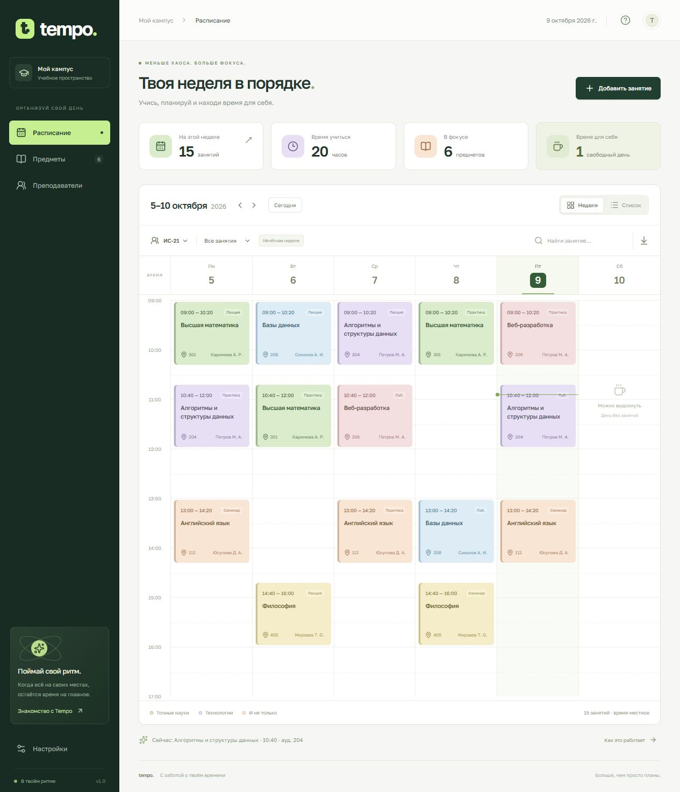

# Tempo

**Твой учебный ритм.** Аккуратное пространство, в котором удобно планировать занятия, находить нужную аудиторию и видеть неделю целиком.

Русскоязычное приложение на React и TypeScript. Работает без сервера и регистрации, сохраняет изменения в браузере и публикуется на GitHub Pages.

**[Открыть Tempo →](https://khujamov05.github.io/tempo-campus/)**



## Возможности

- Недельная сетка и список занятий, переход между неделями и возврат к текущей.
- Несколько учебных групп, справочники предметов и преподавателей; добавление новых записей.
- Добавление, редактирование и удаление занятий с возможностью отменить удаление.
- Повторение каждую неделю, по чётным или нечётным ISO-неделям.
- Проверка пересечений по группе, аудитории и преподавателю, включая разные предметы одного преподавателя.
- Поиск по предмету, коду, преподавателю и аудитории, фильтр по формату занятия.
- Количество занятий, учебные часы, число предметов и свободных учебных дней.
- Экспорт видимых занятий выбранной недели в ICS для календарных приложений.
- Резервное копирование в JSON и проверяемый импорт с подтверждением замены.
- Адаптивный интерфейс, управление с клавиатуры, поддержка уменьшенного движения.

## Запуск

Нужен **Node.js 24+** и npm.

```sh
npm ci
npm run dev
```

Откройте адрес, который напечатает Vite (обычно `http://127.0.0.1:5173`).

```sh
npm test         # тесты бизнес-логики
npm run build   # проверка TypeScript и production-сборка
npm run preview # локальный просмотр готовой сборки
```

## Как пользоваться

1. Выберите группу над расписанием. Начальные занятия демонстрационные, имена вымышлены.
2. Нажмите **Добавить занятие**. Укажите предмет, формат, день, время и аудиторию.
3. Нажмите карточку в сетке, чтобы изменить занятие или удалить его. Изменения относятся к еженедельному шаблону, а не только к выбранной дате.
4. Новые предметы и преподавателей добавляйте в соответствующих разделах; группы — в настройках.
5. Кнопка со стрелкой вниз рядом с поиском скачивает `.ics`. Экспорт учитывает группу, поиск, формат и чётность выбранной недели. Время локальное, без заданного часового пояса; при импорте в календарь выберите свой пояс.
6. В **Настройках** скачайте JSON-копию для переноса на другое устройство. Импорт заменяет текущее пространство после проверки и подтверждения.

Учебные дни: понедельник–суббота. Занятия: с 08:00 до 20:00, минимум 30 минут. Сетка автоматически расширяется под время занятий. Номер недели рассчитывается по ISO 8601, включая переход между годами.

## Хранение и ограничения

Это персональное клиентское приложение: данные находятся в `localStorage` текущего браузера под ключом `tempo-campus-v1`. Здесь нет учётных записей, серверной базы данных, разграничения ролей или совместного редактирования. Очистка данных сайта удаляет сохранённое расписание — для переноса и сохранности используйте JSON-копию.

Расписание — повторяющийся недельный шаблон. Исключения для конкретных дат, каникулы и переносы отдельного занятия не поддерживаются. Справочники позволяют создавать записи; редактирование и удаление существующих записей справочников доступны через экспорт, изменение и импорт JSON с проверкой связей.

При недоступном хранилище приложение показывает предупреждение; изменения остаются в памяти до закрытия страницы. При повреждённых данных исходная сохранённая строка не перезаписывается автоматически. Шрифт Golos Text загружается из Google Fonts; без сети используется системный шрифт.

## Структура

```text
src/
  App.tsx         — экраны, формы, навигация и состояние
  model.ts        — типы данных, расписание, проверки, импорт и ICS
  model.test.ts   — тесты бизнес-логики
  styles.css      — интерфейс и адаптивная вёрстка
  main.tsx        — точка входа
public/
  favicon.svg     — знак Tempo
.github/workflows/deploy.yml — тестирование, сборка и GitHub Pages
scripts/publish.mjs — публикация готовой сборки через Git
```

## Публикация

Сайт опубликован из ветки `gh-pages`. В **Settings → Pages** выбран режим **Deploy from a branch**, ветка **gh-pages**, папка **/ (root)**. Обновить сайт с компьютера с авторизацией GitHub можно командой:

```sh
npm run deploy
```

Команда запускает тесты и сборку, затем публикует только содержимое `dist` в `gh-pages`. Исходники и незакоммиченные изменения в рабочей папке не затрагиваются; принудительная перезапись истории не используется. Сборка использует относительные пути, поэтому работает в подпапке репозитория.

Также подготовлен workflow для полностью автоматической публикации. Когда GitHub Actions доступен в аккаунте, можно переключить **Pages → Source → GitHub Actions**. Workflow проверит тесты, соберёт приложение и опубликует его при обновлении `main`. Для pull request выполняются только проверки.

## Проверки

13 тестов покрывают переход ISO-недель через Новый год, чётность, валидность демоданных, конфликты групп/преподавателей/аудиторий, соприкасающиеся интервалы, редактирование текущего занятия, ограничения длительности, некорректные резервные копии и формирование ICS с корректным экранированием и переносом строк UTF-8.

## Лицензия

MIT — см. [LICENSE](LICENSE).
